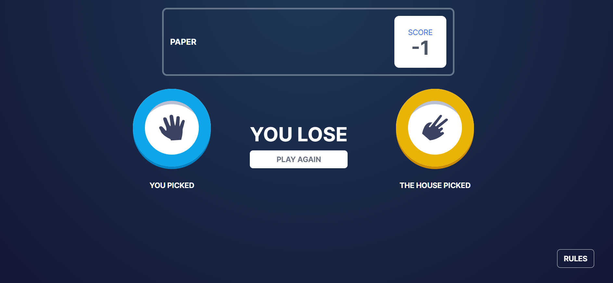
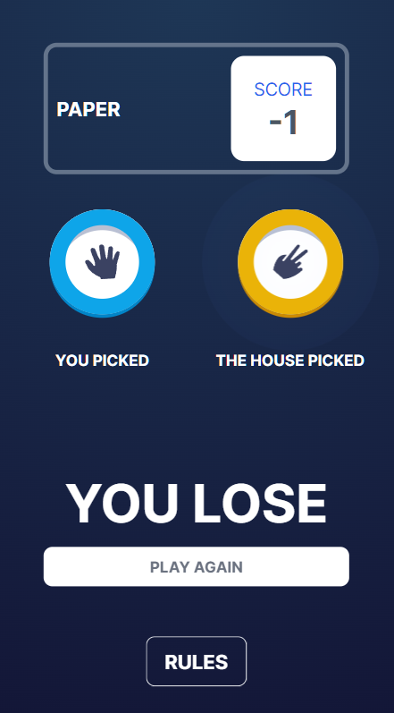
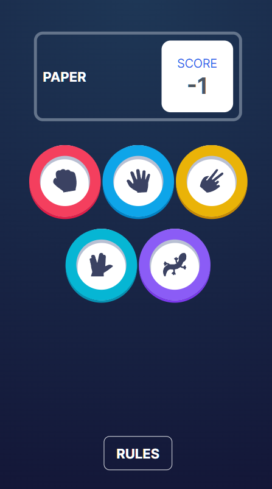

# Frontend Mentor - Rock, Paper, Scissors solution

This is a solution to the [Rock, Paper, Scissors challenge on Frontend Mentor](https://www.frontendmentor.io/challenges/rock-paper-scissors-game-pTgwgvgH). It is using [Next.js](https://nextjs.org/) and [tailwindcss](https://tailwindcss.com/).

## Table of contents

- [Overview](#overview)
  - [The challenge](#the-challenge)
  - [Screenshot](#screenshot)
  - [Links](#links)
- [Built with](#built-with)
- [Author](#author)

## Overview

Users are be able to:

- View the optimal layout for the game depending on their device's screen size
- Play Rock, Paper, Scissors, Lizard, Spock against the computer

### Screenshot

### Links

- [Code](https://github.com/ExplosivePro/rock-paper-scissors)
- [Live Site](https://rock-paper-scissors-iota-dun.vercel.app/)

## Built with

- [React](https://reactjs.org/) - JS library
- [Next.js](https://nextjs.org/) - React framework
- [tailwindcss](https://tailwindcss.com/) - For styling
- [React Context](https://react.dev/reference/react/useContext) - For state management

## Author
explosive0105@gmail.com

Speed Demon
